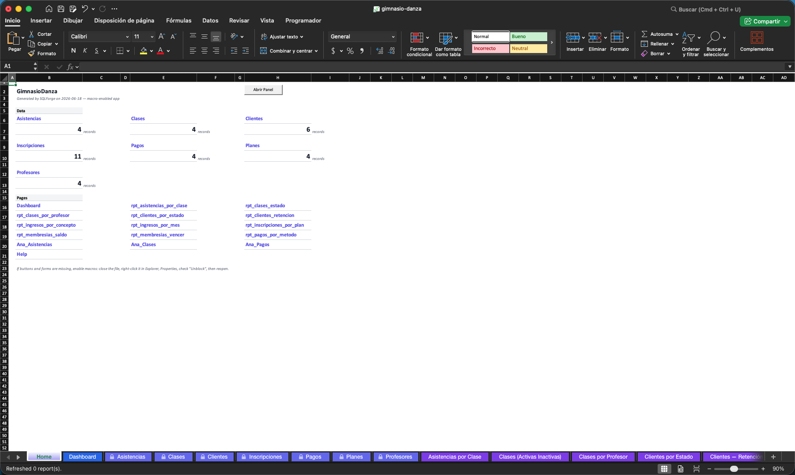
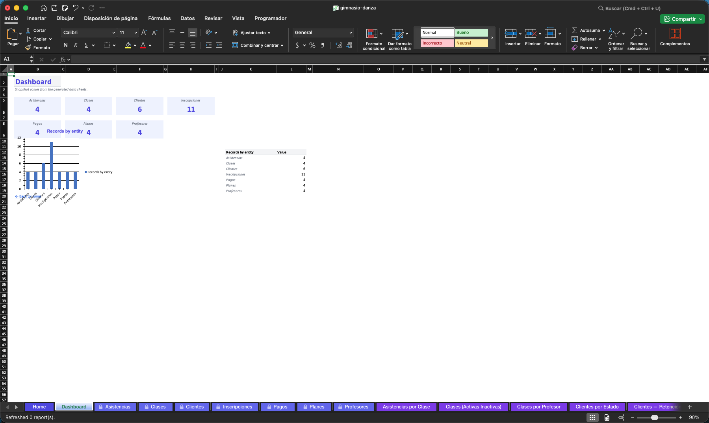
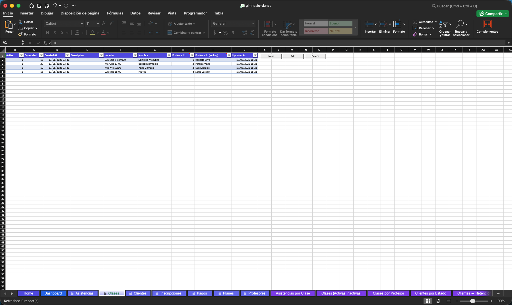
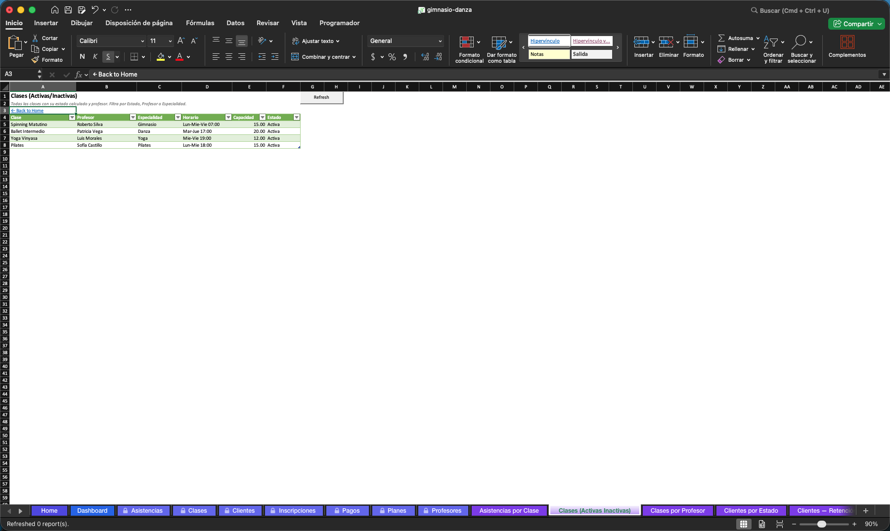

# Gimnasio & Escuela de Danza

Sistema de gestión de clientes para gimnasios y escuelas de danza. Controla membresías, pagos y asistencia a clases — todo desde un solo archivo Excel con macros.

---

## Capturas

### Home — índice de módulos

### Dashboard — resumen de registros

### Clientes — tabla con panel CRUD

### Reportes Power Query

---

## Funcionalidades

| Módulo | Descripción |
|--------|-------------|
| Clientes | Alta, baja y modificación de datos personales |
| Planes / Membresías | Tipos de plan: Gym, Danza, Combo |
| Inscripciones | Control de membresías activas con fechas de vigencia |
| Pagos | Historial de cobros por cliente |
| Clases | Catálogo con horario, instructor y capacidad |
| Asistencias | Registro de asistencia por clase |
| Profesores | Datos de instructores |
| Dashboard | Conteos vivos por entidad |
| 11 Reportes | Power Query actualizables con un click |

---

## Requisitos

- Microsoft Excel 2016 o superior (Windows o macOS)
- Macros habilitadas

## Descarga e instalación

1. Descarga [`gimnasio-danza.xlsm`](./gimnasio-danza.xlsm)
2. Abre en Excel — habilita macros cuando se solicite
3. En Windows: si aparece barra amarilla de seguridad, click en **Habilitar contenido**
4. En macOS: click en **Habilitar macros** en el diálogo inicial

> Ver [`GUIA-USUARIO.md`](./GUIA-USUARIO.md) para instrucciones completas de uso.
