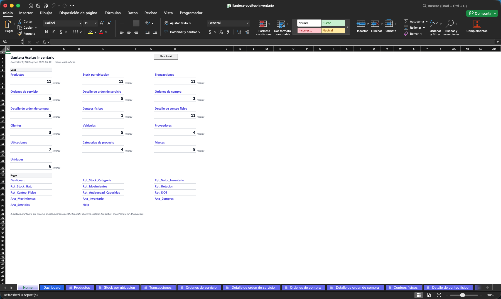
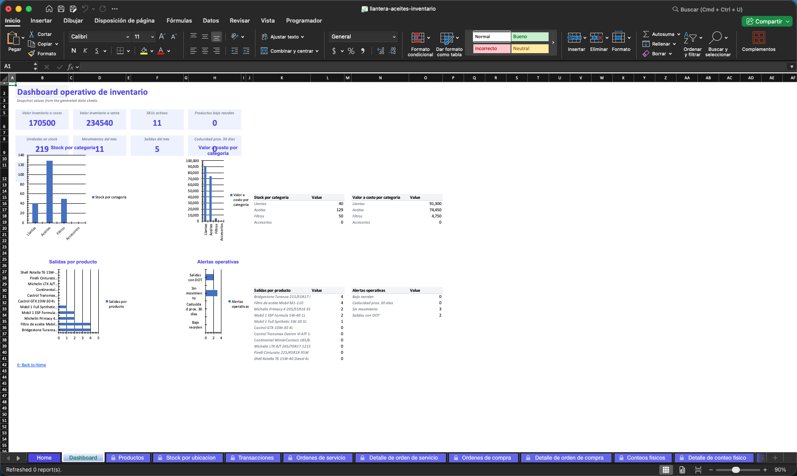
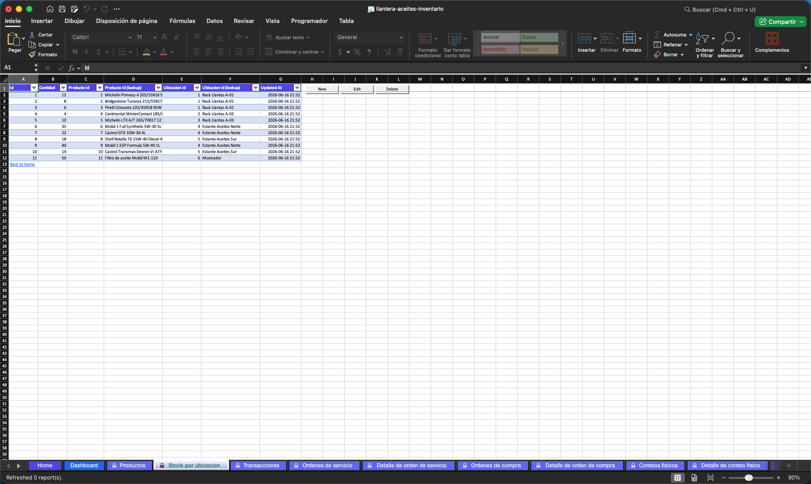
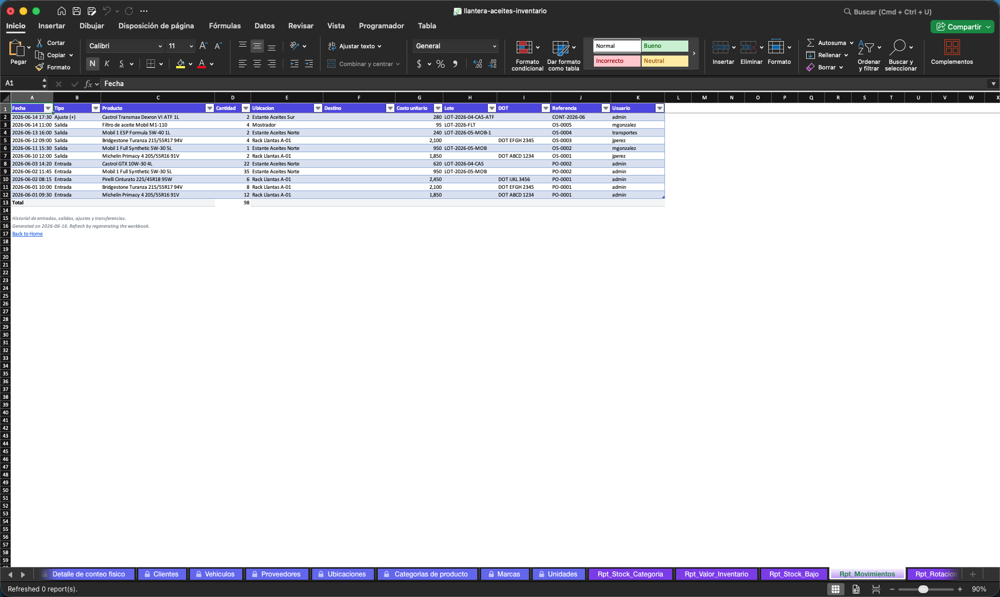

# Sistema de Inventarios de Llantera + Conteo de Aceites

Sistema de control de inventario para llanteras y servicios automotrices. Gestiona entradas, salidas, transferencias y conteos físicos de llantas y aceites, con trazabilidad DOT, FIFO en aceites, y órdenes de compra y servicio.

---

## Capturas

### Home — índice de módulos con conteos vivos

### Dashboard — KPIs y gráficas de inventario

### Transacciones — tabla central de movimientos

### Reporte de movimientos

---

## Funcionalidades

| Módulo | Descripción |
|--------|-------------|
| Productos | Catálogo unificado de llantas y aceites (SKU, precio, stock mínimo) |
| Transacciones | Entrada, Salida, Ajuste (+/-), Transferencia entre ubicaciones |
| Stock por ubicación | Vista proyectada de stock por rack/estante |
| Órdenes de compra | POs con cabecera y detalle de líneas |
| Órdenes de servicio | OS vinculadas a cliente y vehículo |
| Conteos físicos | Cabecera + detalle con diferencias sistema vs. físico |
| Clientes y vehículos | Trazabilidad de venta por DOT de llanta |
| Proveedores | Directorio con condiciones de pago y lead time |
| Dashboard | KPIs vivos: valor de inventario, SKUs activos, alertas de stock |
| 8 Reportes Rpt_ | Snapshots de inventario: valor, rotación, movimientos, compras |
| 4 Análisis Ana_ | PivotTables nativas: movimientos, inventario, compras, servicios |
| Audit log | Bitácora automática de cada cambio (quién, qué, cuándo) |

---

## Requisitos

- Microsoft Excel 2016 o superior (Windows o macOS)
- Macros habilitadas

## Descarga e instalación

1. Descarga [`llantera-aceites-inventario.xlsm`](./llantera-aceites-inventario.xlsm)
2. Abre en Excel — habilita macros cuando se solicite
3. En Windows: si aparece barra amarilla de seguridad, click en **Habilitar contenido**
4. En macOS: click en **Habilitar macros** en el diálogo inicial
5. Verifica: ve a la hoja **Home** y confirma que ves conteos numéricos en todas las entidades

> Ver [`GUIA-USUARIO.md`](./GUIA-USUARIO.md) para instrucciones completas: operaciones del día a día, reportes, troubleshooting y buenas prácticas.

---
