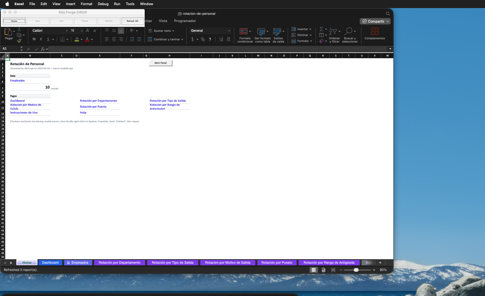
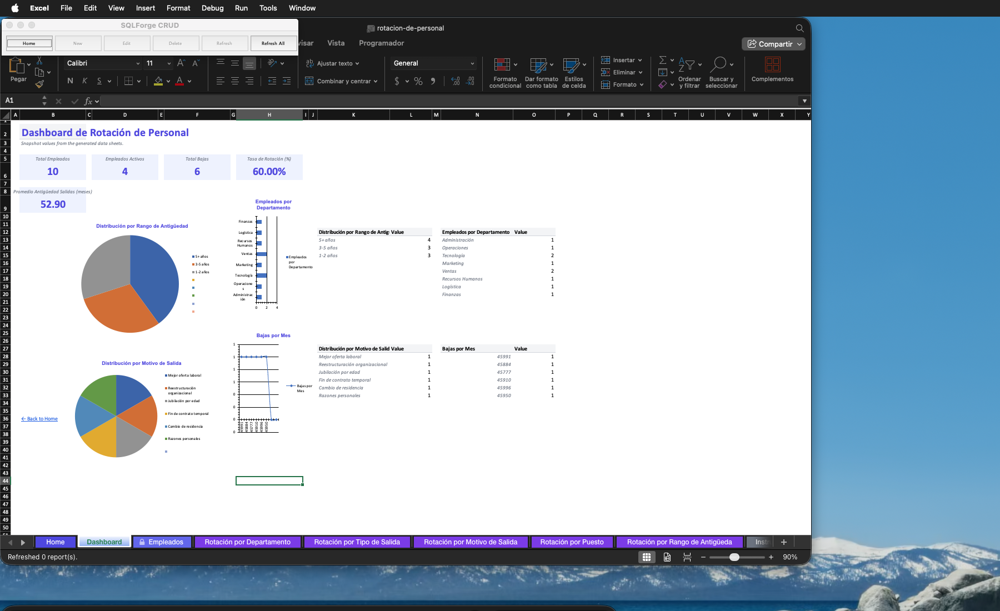
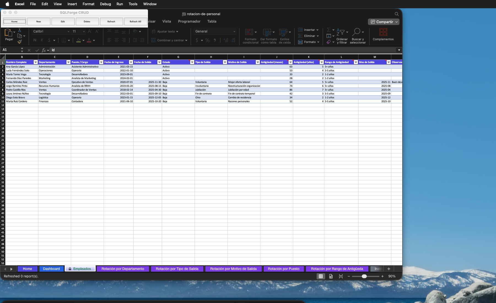
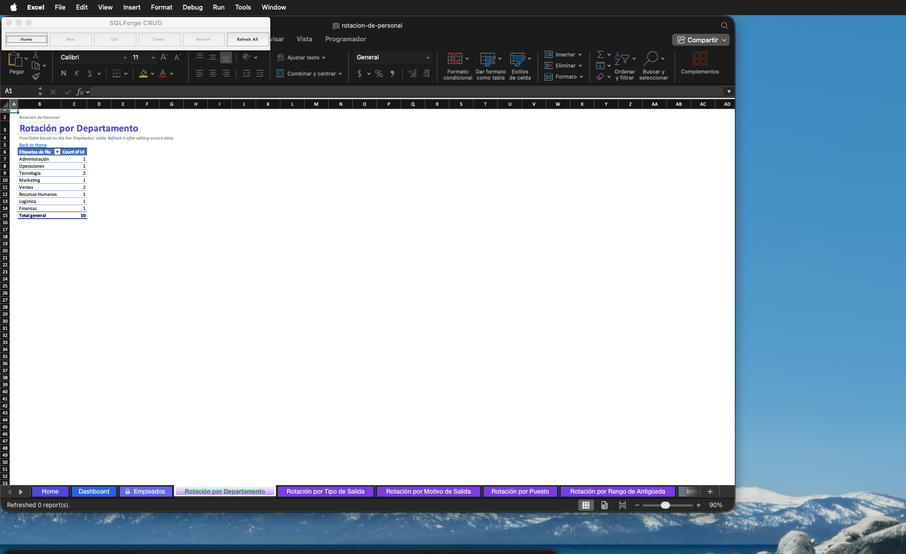
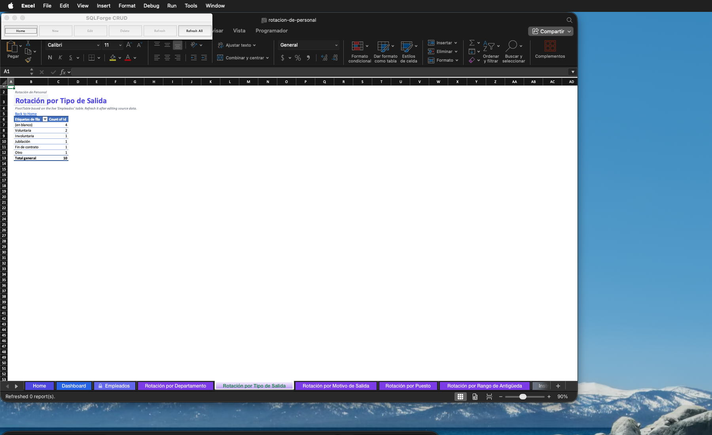
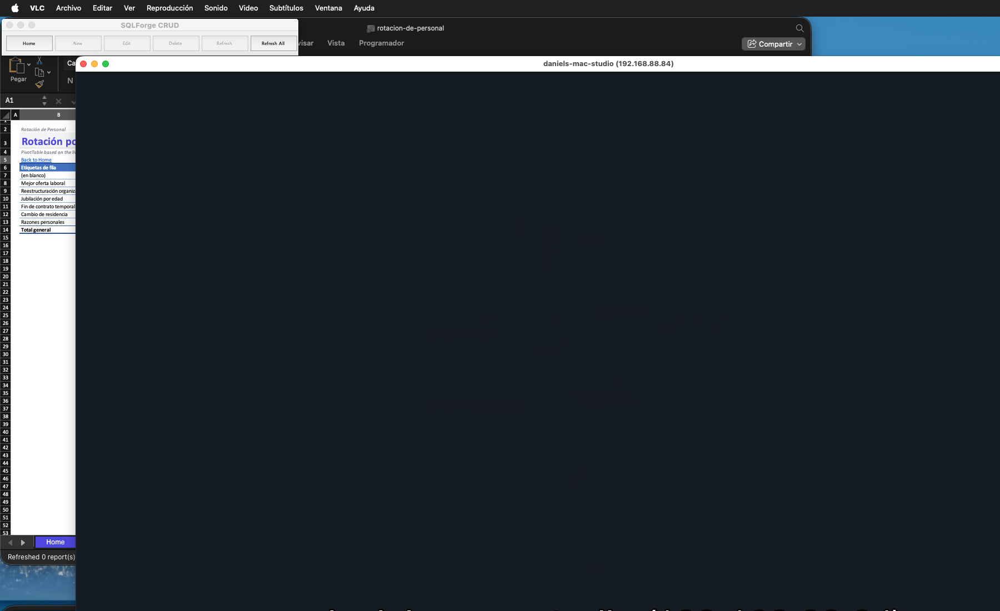
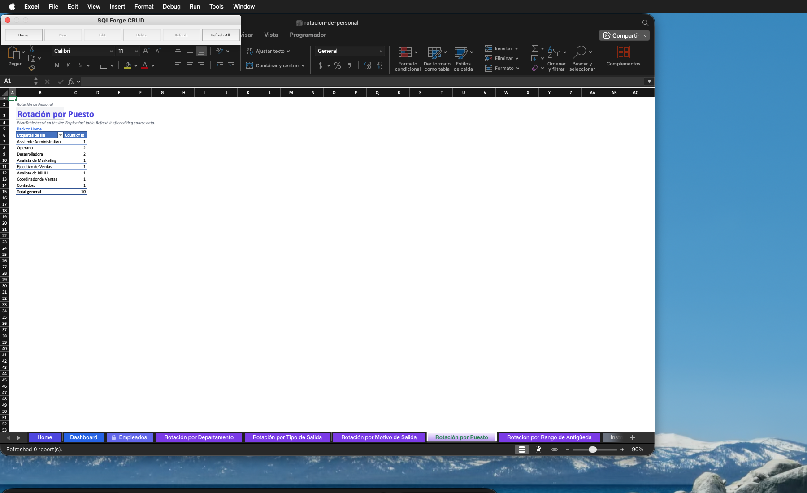
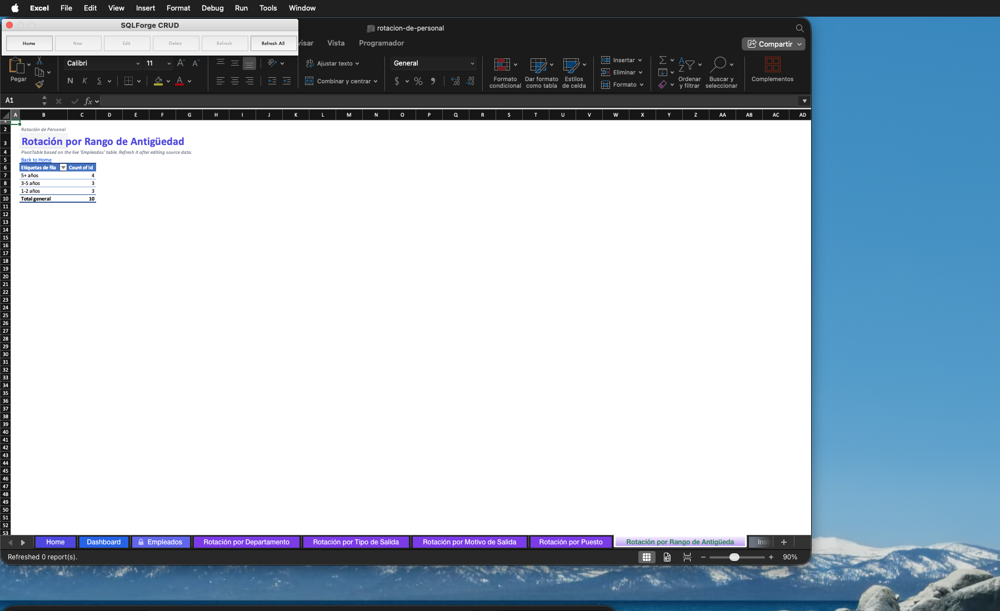
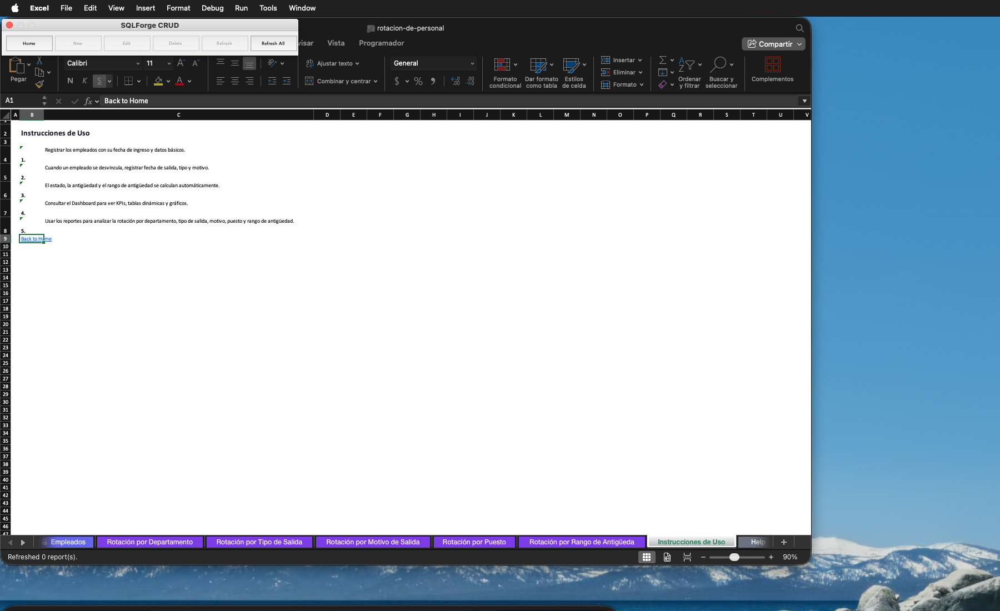

# Rotación de Personal

Aplicación Excel para registrar y controlar la rotación de empleados en una organización.

---

## Capturas

### Pantalla de inicio

### Dashboard de indicadores

### Registro de empleados

### Rotación por departamento

### Rotación por tipo de salida

### Rotación por motivo de salida

### Rotación por puesto

### Rotación por rango de antigüedad

### Instrucciones de uso

---

## Funcionalidades

| Módulo | Descripción |
|--------|-------------|
| <!-- completar --> | <!-- completar --> |

---

## Requisitos

- Microsoft Excel 2016 o superior (Windows o macOS)
- Macros habilitadas

## Descarga e instalación

1. Descarga [`rotacion-de-personal.xlsm`](./rotacion-de-personal.xlsm)
2. Abre en Excel — habilita macros cuando se solicite
3. En Windows: si aparece barra amarilla de seguridad, click en **Habilitar contenido**
4. En macOS: click en **Habilitar macros** en el diálogo inicial

---

## Notas

<!-- Limitaciones, versiones, consideraciones especiales -->
